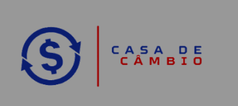

# Casa de Câmbio



## Índice

* [Descrição](##Descrição)
* [Instalação](##Instalação)
* [Linguagens e tecnologias usadas no projeto](##Linguagens-e-tecnologias-usadas-no-projeto)
* [Entrar em contato](##Entrar-em-contato)

## Descrição

A ideia do projeto da Casa de Câmbio veio de um exercício do curso de Desenvolvimento Web da Trybe que tem o recurso de converter uma moeda para diversas outras através do uso de API como objetivo final.
Porém, visando incrementar o projeto e deixar o desafio ainda maior, incluí um visual de site de Casa de Câmbio online usando o Bootstrap e JQuerry. 

## Instalação

### Pré-requisitos

Certifique-se de ter as seguintes ferramentas instaladas em sua máquina:
- [Git](https://git-scm.com/)
- [Node.js](https://nodejs.org/)

### Como baixar, instalar e executar o projeto

Siga os passos abaixo para clonar o repositório e executar o projeto localmente.

#### 1. Clonar o repositório

Abra seu terminal e execute o comando abaixo para clonar o repositório para sua máquina local:

```
git clone git@github.com:amandavenancio/PortfolioAmanda.git
```

#### 2. Navegar até o diretório do projeto

Use o comando cd para mudar para o diretório do projeto clonado:

```
cd seu-repositorio
```

#### 3. Instalar as dependências
Certifique-se de que você tem o Node.js instalado Em seguida, execute o comando abaixo para instalar as dependências do projeto:

```
npm install
```

#### 4. Executar o projeto
Depois de instalar as dependências, você pode iniciar o projeto.

```
npm run dev
```

## Linguagens e tecnologias usadas no projeto

 


## Entrar em contato

Em caso de dúvidas ou sugestões, favor entrar em contato pelo LinkedIn. 

[](www.linkedin.com/in/amanda-a-venancio)


